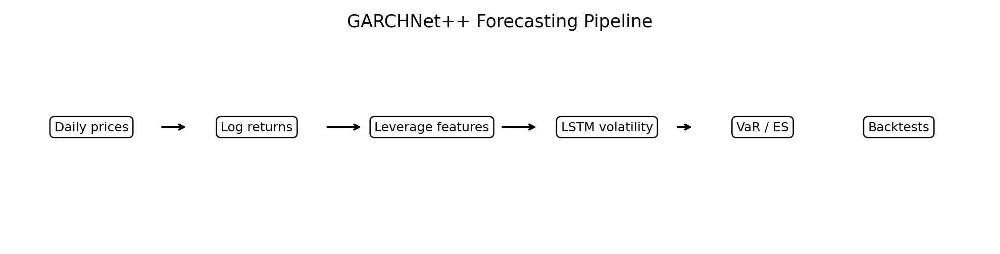
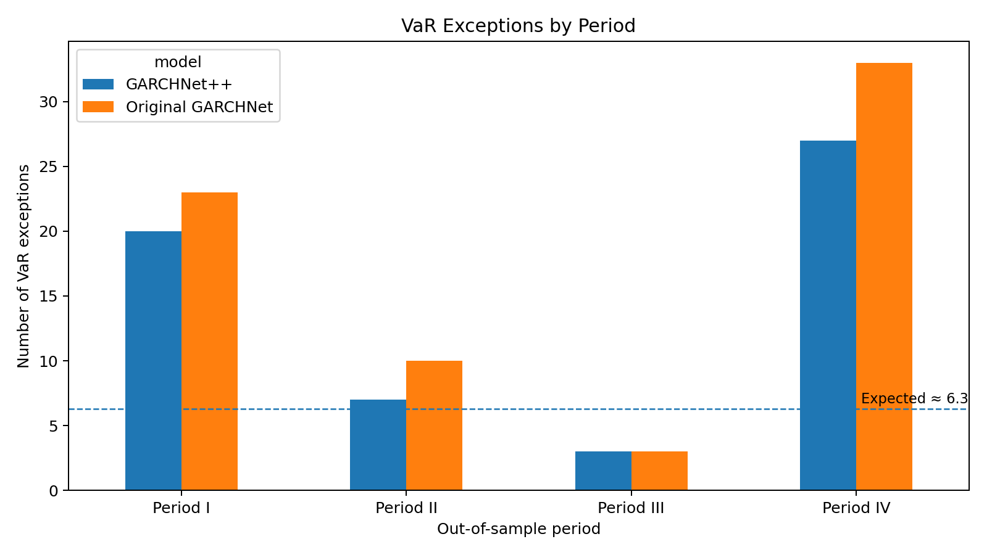
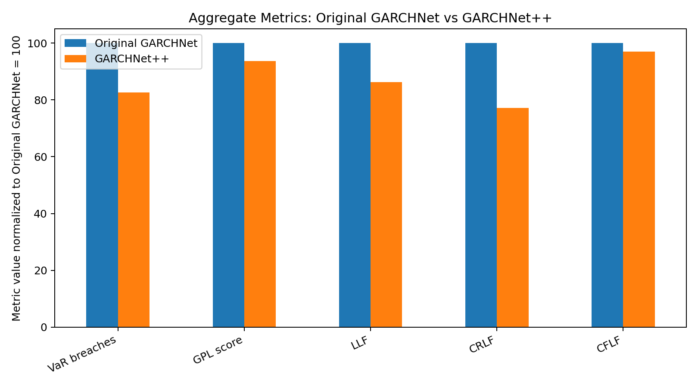
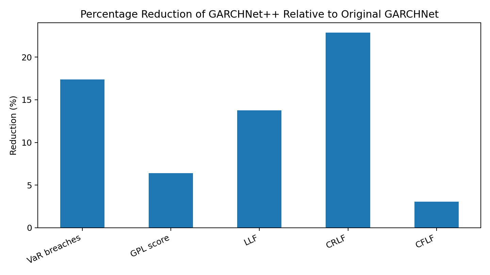

# GARCHNet++: Leverage-Aware VaR and Expected Shortfall Forecasting

This repository implements **GARCHNet++**, a risk-management project extending a paper-style **GARCHNet** Value-at-Risk forecasting baseline.

## Main quantifiable result

Across four 252-day out-of-sample test windows, **GARCHNet++ reduced VaR breaches by 17.4%** compared with the paper-style Original GARCHNet baseline.

| Aggregate metric | Original GARCHNet | GARCHNet++ | Improvement |
|---|---:|---:|---:|
| VaR exceptions | 69 | 57 | **17.4% fewer** |
| GPL score | 0.6143 | 0.5751 | **6.4% lower** |
| LLF | 462.7179 | 398.9787 | **13.8% lower** |
| CRLF | 62.6898 | 48.3467 | **22.9% lower** |
| CFLF | 1162.3284 | 1126.6634 | **3.1% lower** |

**Resume-style outcome:** Reduced **VaR breaches by 17.4%** and **GPL score by 6.4%** over the paper-style **Original GARCHNet** baseline across four 252-day out-of-sample test windows.

## Method overview



```text
Daily prices -> log returns -> leverage-aware features -> LSTM volatility -> VaR / ES -> backtesting
```

## Key formulas

### Log return

```math
r_t = \log(P_t) - \log(P_{t-1})
```

### Leverage-aware GARCHNet++ input

```math
x_t = \left[r_t,\; r_t^2,\; r_t^2 \mathbf{1}(r_t < 0)\right]
```

The third feature captures the leverage effect: negative shocks often raise future risk more strongly than positive shocks of similar size.

### Conditional variance forecast

```math
\sigma_t^2 = f_\theta(x_{t-p}, \ldots, x_{t-1})
```

### Value-at-Risk

```math
\operatorname{VaR}_{t,\alpha} = F_t^{-1}(\alpha)
```

For a zero-mean conditional return model:

```math
\operatorname{VaR}_{t,\alpha} = \sigma_t q_\alpha
```

### Expected Shortfall

```math
\operatorname{ES}_{t,\alpha} = \mathbb{E}\left[r_t \mid r_t < \operatorname{VaR}_{t,\alpha}\right]
```

### VaR exception indicator

```math
I_t = \mathbf{1}\left(r_t < \operatorname{VaR}_{t,\alpha}\right)
```

For a 2.5% VaR level and 252 trading days, a calibrated model should produce roughly:

```math
252 \times 0.025 \approx 6.3
```

exceptions per test window.

## Results visualizations

### VaR exceptions by period



### Original vs GARCHNet++ aggregate metrics

Original GARCHNet is normalized to 100 for every metric. Lower is better for GARCHNet++.



### Percentage reduction



### Forecast-path plot

After running the full experiment, generate actual-return vs VaR forecast paths using:

```bash
python -m experiments.plot_results
```

This will create:

```text
assets/var_forecast_paths.png
```

The script uses `results/paper_window_forecasts.csv`, which is generated by:

```bash
python -m experiments.run_paper_windows
```

## Original GARCHNet baseline

**Original GARCHNet** refers to the paper-style baseline model before improvements. It uses only past returns as the LSTM input:

```text
[r_(t-p), ..., r_(t-1)]
```

## Proposed extension: GARCHNet++

GARCHNet++ uses three input features per timestep:

```text
r_t
r_t^2
r_t^2 * I(r_t < 0)
```

These features capture raw return direction, volatility magnitude, and negative-return asymmetry.

## Baselines

```text
Historical Simulation
GARCH(1,1)
EGARCH
GJR-GARCH
Original GARCHNet
GARCHNet++
```

## Evaluation setup

```text
Ticker: SPY
VaR level: 2.5%
Training window: 1000 returns
Testing window: 252 returns
Sequence length: p = 20
Periods: four paper-style out-of-sample windows beginning in 2005, 2007, 2013, and 2016
```

Each period uses the first 1000 trading returns for training and the following 252 trading returns for one-day-ahead VaR backtesting.

## Period-wise results

| Period | Model | Exceptions | Alpha_hat | UC p-value | CC p-value | DQ p-value | GPL score |
|---|---|---:|---:|---:|---:|---:|---:|
| Period I | Historical Simulation | 11 | 0.0437 | 0.0858 | 0.1380 | 0.0000 | 0.1286 |
| Period I | GARCH | 6 | 0.0238 | 0.9029 | 0.8569 | 0.5758 | 0.1022 |
| Period I | EGARCH | 6 | 0.0238 | 0.9029 | 0.8569 | 0.3271 | 0.1030 |
| Period I | GJR-GARCH | 5 | 0.0198 | 0.5866 | 0.7792 | 0.4326 | 0.1034 |
| Period I | Original GARCHNet | 23 | 0.0913 | 0.0000 | 0.0000 | 0.0000 | 0.1559 |
| Period I | GARCHNet++ | 20 | 0.0794 | 0.0000 | 0.0000 | 0.0000 | 0.1619 |
| Period II | Historical Simulation | 4 | 0.0159 | 0.3204 | 0.5721 | 0.0000 | 0.1177 |
| Period II | GARCH | 11 | 0.0437 | 0.0858 | 0.1380 | 0.0000 | 0.1221 |
| Period II | EGARCH | 10 | 0.0397 | 0.1684 | 0.2558 | 0.0000 | 0.1215 |
| Period II | GJR-GARCH | 11 | 0.0437 | 0.0858 | 0.1380 | 0.0000 | 0.1245 |
| Period II | Original GARCHNet | 10 | 0.0397 | 0.1684 | 0.2558 | 0.0014 | 0.1023 |
| Period II | GARCHNet++ | 7 | 0.0278 | 0.7813 | 0.7871 | 0.0000 | 0.0930 |
| Period III | Historical Simulation | 1 | 0.0040 | 0.0080 | 0.0296 | 0.5926 | 0.0443 |
| Period III | GARCH | 4 | 0.0159 | 0.3204 | 0.5721 | 0.8957 | 0.0344 |
| Period III | EGARCH | 6 | 0.0238 | 0.9029 | 0.8569 | 0.4576 | 0.0350 |
| Period III | GJR-GARCH | 4 | 0.0159 | 0.3204 | 0.5721 | 0.9784 | 0.0343 |
| Period III | Original GARCHNet | 3 | 0.0119 | 0.1387 | 0.3222 | 0.9328 | 0.0387 |
| Period III | GARCHNet++ | 3 | 0.0119 | 0.1387 | 0.3222 | 0.9318 | 0.0377 |
| Period IV | Historical Simulation | 20 | 0.0794 | 0.0000 | 0.0000 | 0.0000 | 0.2534 |
| Period IV | GARCH | 19 | 0.0754 | 0.0000 | 0.0000 | 0.0000 | 0.3020 |
| Period IV | EGARCH | 19 | 0.0754 | 0.0000 | 0.0000 | 0.0000 | 0.2920 |
| Period IV | GJR-GARCH | 21 | 0.0833 | 0.0000 | 0.0000 | 0.0000 | 0.3035 |
| Period IV | Original GARCHNet | 33 | 0.1310 | 0.0000 | 0.0000 | 0.0000 | 0.3174 |
| Period IV | GARCHNet++ | 27 | 0.1071 | 0.0000 | 0.0000 | 0.0000 | 0.2825 |


## Interpretation

GARCHNet++ improves over Original GARCHNet overall, reducing total VaR exceptions and lowering most VaR loss scores. The improvement is strongest in Period II and Period IV, where GARCHNet++ produces fewer breaches than the original neural baseline.

However, the results should not be overstated. Classical GARCH-family models remain competitive in some periods, especially Period I.

> GARCHNet++ improves the paper-style neural GARCHNet baseline, but classical GARCH-family models remain strong benchmarks across market regimes.

## How to run

```bash
python -m venv venv
pip install -r requirements.txt
python -m experiments.run_paper_windows
python -m experiments.plot_results
```

On Windows PowerShell, activate using:

```powershell
.\venv\Scripts\Activate.ps1
```

## GitHub push

```bash
git init
git add .
git commit -m "Add GARCHNet++ VaR forecasting project"
git branch -M main
git remote add origin https://github.com/YOUR_USERNAME/YOUR_REPO_NAME.git
git push -u origin main
```

## Notes

- The current reported results use SPY as a liquid S&P 500 proxy.
- The strongest validated claim is improvement over Original GARCHNet, not universal dominance over all classical GARCH baselines.
